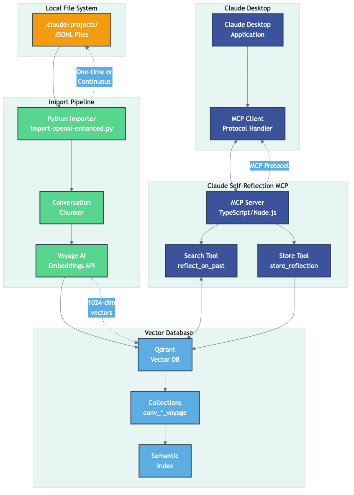

# Claude-Self-Reflect (CSR) - Conversation Memory for Claude Code & Claude Desktop

Give your AI perfect memory across all conversations. Claude-Self-Reflect provides semantic search over your entire conversation history using Qdrant vector database and MCP (Model Context Protocol).

## The Problem, Mechanism & Why

### 🤔 The Problem
Claude has no memory between conversations. Every chat starts from scratch, forcing you to:
- Re-explain context from previous discussions
- Repeat solutions you've already discovered together
- Lose valuable insights from past debugging sessions
- Search through hundreds of conversation files manually

### ⚡ The Mechanism
Claude-Self-Reflect creates a **semantic memory layer** that:

1. **Imports**: Scans your `~/.claude/projects/` directory for conversation history
2. **Processes**: Chunks conversations into searchable segments with metadata
3. **Embeds**: Creates vector representations using Voyage AI or OpenAI embeddings
4. **Stores**: Saves to Qdrant vector database for fast similarity search
5. **Searches**: Provides semantic search through MCP tools in Claude

### 🎯 Why This Approach Works
- **Semantic vs Keyword**: Finds relevant discussions even with different wording
- **Vector Database**: Purpose-built for similarity search, not complex graph traversal
- **MCP Integration**: Native Claude tools - no external interfaces needed
- **Local-First**: Your conversations never leave your machine
- **Incremental**: Only processes new conversations, not full re-imports

## 🚀 Choose Your Embedding Provider

Embedding models convert your conversations into numbers that enable semantic search. Choose the option that best fits your needs:

### 🥇 Voyage AI (Recommended)
- ✅ **200M tokens FREE** - covers most users completely  
- ✅ Best quality for conversation search
- ✅ Only $0.02/1M tokens after free tier
- 🔗 [Get API key](https://dash.voyageai.com/)

**Why choose Voyage?** Purpose-built for retrieval tasks, massive free tier means most users never pay.

### 🥈 Google Gemini (Free Alternative)
- ✅ **Completely FREE** (unlimited usage)
- ⚠️ Your data used to improve Google products  
- ✅ Good multilingual support
- 🔗 [Get API key](https://ai.google.dev/gemini-api/docs)

**Why choose Gemini?** Best for users who want unlimited free usage and don't mind data sharing.

### 🥉 Local Processing (Privacy First)
- ✅ **Completely FREE**, works offline
- ✅ No API keys, no data sharing
- ⚠️ Lower quality results, slower processing
- 🔗 No setup required

**Why choose Local?** Perfect for privacy-focused users or those who want to avoid any external dependencies.

### 🏅 OpenAI (If You Have Credits)
- ❌ No free tier
- ✅ $0.02/1M tokens (same as Voyage paid)  
- ✅ Good quality, established ecosystem
- 🔗 [Get API key](https://platform.openai.com/api-keys)

**Why choose OpenAI?** If you already have OpenAI credits or prefer their ecosystem.

---

## 🚀 Installation

### Quick Start (Claude Code)

```bash
# One command setup - handles everything interactively
npm install -g claude-self-reflect && claude-self-reflect setup
```

**That's it!** The interactive setup will:
1. ✅ Install the reflection agent automatically  
2. ✅ Guide you through choosing an embedding provider
3. ✅ Help you get API keys (with direct links)
4. ✅ Start Qdrant database (via Docker)
5. ✅ Import your Claude conversation history
6. ✅ Test that everything works

**💡 What if I don't have Docker?** The setup will detect this and offer alternatives including local-only options.

**🔄 Already installed?** Just run `claude-self-reflect setup` to reconfigure or import new conversations.

### Manual Setup (Advanced Users)

If you prefer manual control:

```bash
# 1. Install
npm install -g claude-self-reflect

# 2. Interactive setup  
claude-self-reflect setup

# 3. Or manual steps (see Advanced Configuration section)
```

The reflection agent will activate when you ask:
```
Find our previous discussions about API design
What did we talk about regarding authentication?
Check if we've solved this error before
```

### For Claude Desktop
Add to your Claude Desktop config:
```json
{
  "mcpServers": {
    "claude-self-reflect": {
      "command": "npx",
      "args": ["claude-self-reflect"],
      "env": {
        "QDRANT_URL": "http://localhost:6333"
      }
    }
  }
}
```

## Architecture Overview



The system consists of four main components:
- **Claude Code/Desktop**: The MCP client that requests memory operations
- **MCP Server**: TypeScript service providing search and store tools
- **Import Pipeline**: Python service that processes conversation logs
- **Qdrant Database**: Vector storage with semantic search capabilities

See also:
- [Data Flow Diagram](docs/diagrams/data-flow.png) - How data moves through the system
- [Import Process](docs/diagrams/import-process.png) - Detailed import workflow
- [Search Operation](docs/diagrams/search-operation.png) - How semantic search works

## Why Qdrant Over Neo4j?

1. **Simplicity**: Two tools (store/find) vs complex entity/relationship management
2. **Performance**: Optimized for semantic search, no graph traversal overhead
3. **Proven Pattern**: Industry standard for conversation memory (LangChain, Dify, etc.)
4. **No Import Issues**: Direct vector storage without entity extraction complexity

## Components

### 1. Qdrant Vector Database
- Stores conversation embeddings with metadata
- Provides fast semantic similarity search
- Built-in vector indexing and retrieval

### 2. MCP Server for Conversation Memory
- **Tool 1**: `store_reflection` - Store important insights and decisions
- **Tool 2**: `reflect_on_past` - Search through conversation history
- Simple semantic search without complex entity extraction

### 3. Python Importer
- Reads JSONL files from Claude conversation logs
- Creates conversation chunks for context
- Generates embeddings using Voyage AI (voyage-3.5-lite)
- Stores directly in Qdrant with metadata


## Using the Reflection Agent

### In Claude Code
The reflection agent activates automatically when you ask about past conversations:


```
"What did we discuss about database design?"
"Find our previous debugging session"
"Have we encountered this error before?"
```

Or explicitly request it:
```
"Use the reflection agent to search for our API discussions"
```

### Direct Tool Usage (Advanced)
You can also ask Claude to search directly:

```
User: Can you check our past conversations about authentication?
Claude: I'll search through our conversation history about authentication...

User: Remember that we decided to use JWT tokens for the API
Claude: I'll store this decision for future reference...
```

## 🧪 Testing & Dry-Run Mode

### Validate Your Setup

Before importing, validate that everything is configured correctly:

```bash
# Run comprehensive validation
python scripts/validate-setup.py

# Example output:
# ✅ API Key         [PASS] Voyage API key is valid
# ✅ Qdrant          [PASS] Connected to http://localhost:6333
# ✅ Claude Logs     [PASS] 24 projects, 265 files, 125.3 MB
# ✅ Disk Space      [PASS] 45.2 GB free
```

### Dry-Run Mode

Test the import process without making any changes:

```bash
# See what would be imported (no API calls, no database changes)
python scripts/import-openai-enhanced.py --dry-run

# Dry-run with preview of sample chunks
python scripts/import-openai-enhanced.py --dry-run --preview

# Validate setup only (checks connections, API keys, etc.)
python scripts/import-openai-enhanced.py --validate-only
```

### Example Dry-Run Output

```
🔍 Running in DRY-RUN mode...
============================================================
🚀 Initializing Claude-Self-Reflect Importer...

📊 Import Summary:
  • Total files: 265
  • New files to import: 265
  • Estimated chunks: ~2,650
  • Estimated cost: FREE (within 200M token limit)
  • Embedding model: voyage-3.5-lite

🔍 DRY-RUN MODE - No changes will be made

⏳ Starting import...

[DRY-RUN] Would ensure collection: conv_a1b2c3d4_voyage
[DRY-RUN] Would import 127 chunks to collection: conv_a1b2c3d4_voyage

📊 Final Statistics:
  • Time elapsed: 2 seconds
  • Projects to import: 24
  • Messages processed: 10,165
  • Chunks created: 2,650
  • Embeddings would be generated: 2,650
  • API calls would be made: 133
  • 💰 Estimated cost: FREE (within 200M token limit)
```

### Cost Estimation

The dry-run mode provides accurate cost estimates:

**Free Tiers:**
- Voyage AI: 200M tokens FREE, then $0.02 per 1M tokens
- Google Gemini: Unlimited FREE (data used for training)
- Local: Always FREE

**Paid Only:**
- OpenAI: $0.02 per 1M tokens (no free tier)

**Reality Check:** With 500 tokens per conversation chunk, 200M free tokens = ~400,000 conversation chunks. Most users never reach the paid tier.

### Continuous Testing

```bash
# Test import of a single project
python scripts/import-openai-enhanced.py ~/.claude/projects/my-project --dry-run

# Monitor import progress in real-time
python scripts/import-openai-enhanced.py --dry-run | tee import-test.log
```

## 🤝 Why Claude-Self-Reflect?

### Key Advantages
- **Local-First**: Your conversations stay on your machine
- **Zero Configuration**: Works out of the box with sensible defaults
- **Claude-Native**: Built specifically for Claude Code & Desktop  
- **Semantic Search**: Understands meaning, not just keywords
- **Continuous Import**: Automatically indexes new conversations
- **Privacy-Focused**: No data leaves your local environment

### Technical Features
- **Vector Database**: Qdrant for fast semantic search
- **Multiple Embeddings**: Support for Voyage AI, OpenAI, or local models
- **Per-Project Collections**: Isolated memory per project
- **Cross-Project Search**: Find information across all projects when needed
- **Incremental Updates**: Only process new conversations

### CLAUDE.md vs Claude-Self-Reflect

| Aspect | CLAUDE.md | Claude-Self-Reflect |
|--------|-----------|-------------------|
| **Purpose** | Project-specific instructions | Conversation memory across all projects |
| **Scope** | Single project context | Global conversation history |
| **Storage** | Text file in project | Vector database (Qdrant) |
| **Search** | Exact text matching | Semantic similarity search |
| **Updates** | Manual editing | Automatic indexing |
| **Best For** | Project rules & guidelines | Finding past discussions & decisions |

**Use both together**: CLAUDE.md for project-specific rules, Claude-Self-Reflect for conversation history.

## 🧑‍💻 Advanced Configuration

### Manual Setup Steps

If you prefer manual control over the automated setup:

**1. Start Qdrant Database**
```bash
docker run -d --name qdrant -p 6333:6333 qdrant/qdrant:latest
```

**2. Choose & Configure Embedding Provider**
```bash
# Voyage AI (Recommended - 200M tokens FREE)
export VOYAGE_API_KEY="your-api-key"

# OR Google Gemini (Unlimited FREE)  
export GEMINI_API_KEY="your-api-key"

# OR OpenAI (No free tier)
export OPENAI_API_KEY="your-api-key"

# OR Local Processing (Always FREE)
export USE_LOCAL_EMBEDDINGS=true
```

**3. Import Conversations**
```bash
git clone https://github.com/ramakay/claude-self-reflect.git
cd claude-self-reflect
pip install -r scripts/requirements.txt
python scripts/import-openai-enhanced.py
```

### Environment Variables
```bash
# Embedding Provider (choose one)
VOYAGE_API_KEY=your-key      # 200M tokens FREE, then $0.02/1M
GEMINI_API_KEY=your-key      # Unlimited FREE (data shared)
OPENAI_API_KEY=your-key      # $0.02/1M tokens (no free tier)
USE_LOCAL_EMBEDDINGS=true    # Always FREE (lower quality)

# Qdrant Configuration
QDRANT_URL=http://localhost:6333  # Default local Qdrant
```

### Programmatic Usage
```javascript
import { ClaudeSelfReflect } from 'claude-self-reflect';

const memory = new ClaudeSelfReflect({
  qdrantUrl: 'http://localhost:6333',
  embeddingProvider: 'voyage',
  apiKey: process.env.VOYAGE_API_KEY
});

// Search conversations
const results = await memory.search('React hooks');

// Store new memory
await memory.store({
  content: 'Discussed React performance optimization',
  metadata: { project: 'my-app', timestamp: Date.now() }
});
```

### Contributing

We love contributions! Check out our [Contributing Guide](CONTRIBUTING.md) for:

- 🐛 Bug reports and fixes
- ✨ Feature requests and implementations
- 📚 Documentation improvements
- 🧪 Test coverage expansion

## 🛠️ Advanced Configuration

### Custom Embedding Models

```bash
# Use OpenAI's latest model
EMBEDDING_MODEL=text-embedding-3-large

# Use Voyage's latest model  
EMBEDDING_MODEL=voyage-3

# Use a custom Hugging Face model
EMBEDDING_MODEL=intfloat/e5-large-v2
```

### Performance Tuning

```bash
# For large conversation histories (>10K files)
BATCH_SIZE=100
CHUNK_SIZE=20
WORKERS=8

# For limited memory systems
BATCH_SIZE=10
CHUNK_SIZE=5
QDRANT_MEMORY=512m
```

### Multi-User Setup

```bash
# Separate collections per user
COLLECTION_PREFIX=user_${USER}

# Restrict search to specific projects
ALLOWED_PROJECTS=work,personal
```

## 📊 Monitoring & Maintenance

### Health Dashboard

```bash
# Check system status
./health-check.sh

# Example output:
✅ Qdrant: Healthy (1.2M vectors, 24 collections)
✅ MCP Server: Connected
✅ Import Queue: 0 pending
✅ Last Import: 2 minutes ago
✅ Search Performance: 67ms avg (last 100 queries)
```

### Useful Commands

```bash
# Validate entire setup
python scripts/validate-setup.py

# Test import without making changes
python scripts/import-openai-enhanced.py --dry-run

# View import progress
docker compose logs -f importer

# Check collection statistics
python scripts/check-collections.py

# Test search quality
npm test -- --grep "search quality"

# Backup your data
./backup.sh /path/to/backup

# Restore from backup
./restore.sh /path/to/backup
```

## 🔧 Troubleshooting

### Common Issues & Solutions

<details>
<summary><b>Claude can't find the MCP server</b></summary>

1. The reflection agent is automatically available after installation
2. For Claude Desktop, restart after configuration
2. Check if the config was added: `cat ~/Library/Application\ Support/Claude/claude_desktop_config.json`
3. Ensure Docker is running: `docker ps`
4. Check MCP server logs: `docker compose logs claude-self-reflection`

</details>

<details>
<summary><b>Search returns no results</b></summary>

1. Verify import completed: `docker compose logs importer | grep "Import complete"`
2. Check collection has data: `curl http://localhost:6333/collections`
3. Try lowering similarity threshold: `MIN_SIMILARITY=0.5`
4. Test with exact phrases from recent conversations

</details>

<details>
<summary><b>Import is slow or hanging</b></summary>

1. Check available memory: `docker stats`
2. Reduce batch size: `BATCH_SIZE=10`
3. Use local embeddings for testing: `USE_LOCAL_EMBEDDINGS=true`
4. Check for large conversation files: `find ~/.claude/projects -name "*.jsonl" -size +10M`

</details>

<details>
<summary><b>API key errors</b></summary>

1. Verify your API key is correct in `.env`
2. Check API key permissions (embeddings access required)
3. Test API key directly: `curl -H "Authorization: Bearer $VOYAGE_API_KEY" https://api.voyageai.com/v1/models`
4. Try alternative provider (OpenAI vs Voyage)

</details>

### Still Need Help?

- 📚 Check our [comprehensive docs](https://github.com/ramakay/claude-self-reflect/wiki)
- 💬 Ask in [Discussions](https://github.com/ramakay/claude-self-reflect/discussions)
- 🐛 Report bugs in [Issues](https://github.com/ramakay/claude-self-reflect/issues)

## 🚢 Roadmap

### Near Term (Q1 2025)
- [x] One-command installation
- [x] Continuous import watching
- [x] Cross-project search
- [ ] Conversation summarization
- [ ] Time-based filtering
- [ ] Export conversation history

### Medium Term (Q2 2025)
- [ ] Multi-modal memory (images, code blocks)
- [ ] Conversation analytics dashboard
- [ ] Team sharing capabilities
- [ ] Cloud sync option (encrypted)
- [ ] VS Code extension

### Long Term (2025+)
- [ ] Active learning from search patterns
- [ ] Conversation graph visualization
- [ ] Integration with other AI assistants
- [ ] Enterprise features

## 🙏 Acknowledgments

- [Anthropic](https://anthropic.com) for Claude and the MCP protocol
- [Qdrant](https://qdrant.tech) for the amazing vector database
- [Voyage AI](https://voyageai.com) for best-in-class embeddings
- All our [contributors](https://github.com/ramakay/claude-self-reflect/graphs/contributors)

## 📜 License

MIT License - see [LICENSE](LICENSE) for details.

---

<p align="center">
  <i>Built with ❤️ for the Claude community</i><br>
  <b>Star ⭐ this repo if it helps you remember!</b>
</p>