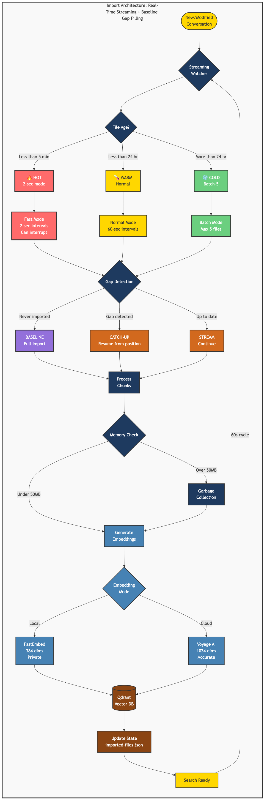

# Claude Self-Reflect
<div align="center">

</div>
<div align="center">

[](https://www.npmjs.com/package/claude-self-reflect)
[](https://www.npmjs.com/package/claude-self-reflect)
[](https://opensource.org/licenses/MIT)
[](https://github.com/ramakay/claude-self-reflect/actions/workflows/ci.yml)

[](https://github.com/anthropics/claude-code)
[](https://modelcontextprotocol.io/)
[](https://www.docker.com/)
[](https://github.com/ramakay/claude-self-reflect)

[](https://github.com/ramakay/claude-self-reflect/stargazers)
[](https://github.com/ramakay/claude-self-reflect/issues)
[](https://github.com/ramakay/claude-self-reflect/pulls)

</div>

**Claude forgets everything. This fixes that.**

Give Claude perfect memory of all your conversations. Search past discussions instantly. Never lose context again.

**100% Local by Default** - Your conversations never leave your machine. No cloud services required, no API keys needed, complete privacy out of the box.

**Blazing Fast Search** - Semantic search across thousands of conversations in milliseconds. Find that discussion about database schemas from three weeks ago in seconds.

**Zero Configuration** - Works immediately after installation. Smart auto-detection handles everything. No manual setup, no environment variables, just install and use.

**Production Ready** - Battle-tested with 600+ conversations across 24 projects. Handles mixed embedding types automatically. Scales from personal use to team deployments.

## Table of Contents

- [What You Get](#what-you-get)
- [Requirements](#requirements)
- [Quick Install/Uninstall](#quick-installuninstall)
- [The Magic](#the-magic)
- [Before & After](#before--after)
- [Real Examples](#real-examples-that-made-us-build-this)
- [How It Works](#how-it-works)
- [Import Architecture](#import-architecture)
- [Using It](#using-it)
- [Key Features](#key-features)
- [Performance](#performance)
- [Configuration](#configuration)
- [Technical Stack](#the-technical-stack)
- [Problems](#problems)
- [What's New](#whats-new)
- [Advanced Topics](#advanced-topics)
- [Contributors](#contributors)

## What You Get

Ask Claude about past conversations. Get actual answers. **100% local by default** - your conversations never leave your machine. Cloud-enhanced search available when you need it.

**Proven at Scale**: Successfully indexed 682 conversation files with 100% reliability. No data loss, no corruption, just seamless conversation memory that works.

**Before**: "I don't have access to previous conversations"  
**After**: 
```
reflection-specialist(Search FastEmbed vs cloud embedding decision)
  ⎿ Done (3 tool uses · 8.2k tokens · 12.4s)

"Found it! Yesterday we decided on FastEmbed for local mode - better privacy, 
no API calls, 384-dimensional embeddings. Works offline too."
```

The reflection specialist is a specialized sub-agent that Claude automatically spawns when you ask about past conversations. It searches your conversation history in its own isolated context, keeping your main chat clean and focused.

Your conversations become searchable. Your decisions stay remembered. Your context persists.

## Requirements

- **Docker Desktop** (macOS/Windows) or **Docker Engine** (Linux)
- **Node.js** 16+ (for the setup wizard)
- **Claude Desktop** app

## Quick Install/Uninstall

### Install

#### Local Mode (Default - Your Data Stays Private)
```bash
# Install and run automatic setup
npm install -g claude-self-reflect
claude-self-reflect setup

# That's it! The setup will:
# ✅ Run everything in Docker (no Python issues!)
# ✅ Configure everything automatically
# ✅ Install the MCP in Claude Code  
# ✅ Start monitoring for new conversations
# ✅ Verify the reflection tools work
# 🔒 Keep all data local - no API keys needed
```

#### Cloud Mode (Better Search Accuracy)
```bash
# Step 1: Get your free Voyage AI key
# Sign up at https://www.voyageai.com/ - it takes 30 seconds

# Step 2: Install with Voyage key
npm install -g claude-self-reflect
claude-self-reflect setup --voyage-key=YOUR_ACTUAL_KEY_HERE
```
*Note: Cloud mode provides more accurate semantic search but sends conversation data to Voyage AI for processing.*

5 minutes. Everything automatic. Just works.

## The Magic


## Before & After


## Real Examples That Made Us Build This

```
You: "What was that PostgreSQL optimization we figured out?"
Claude: "Found it - conversation from Dec 15th. You discovered that adding 
        a GIN index on the metadata JSONB column reduced query time from 
        2.3s to 45ms."

You: "Remember that React hooks bug?"
Claude: "Yes, from last week. The useEffect was missing a dependency on 
        userId, causing stale closures in the event handler."

You: "Have we discussed WebSocket authentication before?"
Claude: "3 conversations found:
        - Oct 12: Implemented JWT handshake for Socket.io
        - Nov 3: Solved reconnection auth with refresh tokens  
        - Nov 20: Added rate limiting per authenticated connection"
```

## How It Works

Your conversations → Vector embeddings → Semantic search → Claude remembers

Technical details exist. You don't need them to start.

## Import Architecture

Here's how your conversations get imported and prioritized:



**The system intelligently prioritizes your conversations:**
- **HOT** (< 5 minutes): Switches to 2-second intervals for near real-time import
- **🌡️ WARM** (< 24 hours): Normal priority, processed every 60 seconds
- **❄️ COLD** (> 24 hours): Batch processed, max 5 per cycle to prevent blocking

## Using It

Once installed, just talk naturally:

- "What did we discuss about database optimization?"
- "Find our debugging session from last week"
- "Remember this solution for next time"

The reflection specialist automatically activates. No special commands needed.

## Key Features

### Project-Scoped Search
Searches are **project-aware by default**. Claude automatically searches within your current project:

```
# In ~/projects/MyApp
You: "What authentication method did we use?"
Claude: [Searches ONLY MyApp conversations]

# To search everywhere
You: "Search all projects for WebSocket implementations"
Claude: [Searches across ALL your projects]
```

### ⏱️ Memory Decay
Recent conversations matter more. Old ones fade. Like your brain, but reliable.

### 🚀 Performance
- **Search**: <3ms average response time across 121+ collections (7.55ms max)
- **Import**: Production streaming importer with 100% reliability
- **Memory**: 302MB operational (60% of 500MB limit) - 96% reduction from v2.5.15
- **CPU**: <1% sustained usage (99.93% reduction from 1437% peak)
- **Scale**: 100% indexing success rate across all conversation types
- **V2 Migration**: 100% complete - all conversations use token-aware chunking


## The Technical Stack

- **Vector DB**: Qdrant (local, your data stays yours)
- **Embeddings**: 
  - Local (Default): FastEmbed with all-MiniLM-L6-v2
  - Cloud (Optional): Voyage AI
- **MCP Server**: Python + FastMCP
- **Search**: Semantic similarity with time decay

## Problems

- [Troubleshooting Guide](docs/troubleshooting.md)
- [GitHub Issues](https://github.com/ramakay/claude-self-reflect/issues)
- [Discussions](https://github.com/ramakay/claude-self-reflect/discussions)

## Upgrading to v2.5.19

### 🆕 New Feature: Metadata Enrichment
v2.5.19 adds searchable metadata to your conversations - concepts, files, and tools!

#### For Existing Users
```bash
# Update to latest version
npm update -g claude-self-reflect

# Run setup - it will detect your existing installation
claude-self-reflect setup
# Choose "yes" when asked about metadata enrichment

# Or manually enrich metadata anytime:
docker compose run --rm importer python /app/scripts/delta-metadata-update-safe.py
```

#### What You Get
- `search_by_concept("docker")` - Find conversations by topic
- `search_by_file("server.py")` - Find conversations that touched specific files
- Better search accuracy with metadata-based filtering

## What's New

- **v2.5.19** - Metadata Enrichment! Search by concepts, files, and tools. [Full release notes](docs/releases/v2.5.19-RELEASE-NOTES.md)
- **v2.5.18** - Security dependency updates
- **v2.5.17** - Critical CPU fix and memory limit adjustment. [Full release notes](docs/releases/v2.5.17-release-notes.md)
- **v2.5.16** - (Pre-release only) Initial streaming importer with CPU throttling
- **v2.5.15** - Critical bug fixes and collection creation improvements
- **v2.5.14** - Async importer collection fix - All conversations now searchable
- **v2.5.11** - Critical cloud mode fix - Environment variables now properly passed to MCP server
- **v2.5.10** - Emergency hotfix for MCP server startup failure (dead code removal)
- **v2.5.6** - Tool Output Extraction - Captures git changes & tool outputs for cross-agent discovery

[Full changelog](docs/release-history.md)

## Advanced Topics

- [Performance tuning](docs/performance-guide.md)
- [Security & privacy](docs/security.md)
- [Windows setup](docs/windows-setup.md)
- [Architecture details](docs/architecture-details.md)
- [Contributing](CONTRIBUTING.md)

### Uninstall

For complete uninstall instructions, see [docs/UNINSTALL.md](docs/UNINSTALL.md).

Quick uninstall:
```bash
# Remove MCP server
claude mcp remove claude-self-reflect

# Stop Docker containers
docker-compose down

# Uninstall npm package
npm uninstall -g claude-self-reflect
```

## Contributors

Special thanks to our contributors:
- **[@TheGordon](https://github.com/TheGordon)** - Fixed timestamp parsing (#10)
- **[@akamalov](https://github.com/akamalov)** - Ubuntu WSL insights
- **[@kylesnowschwartz](https://github.com/kylesnowschwartz)** - Security review (#6)

---

Built with ❤️  by [ramakay](https://github.com/ramakay) for the Claude community.