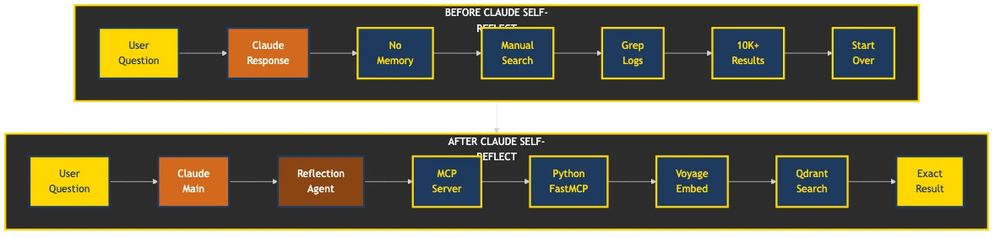

# Claude Self-Reflect

Claude forgets everything. This fixes that.

## What You Get

Ask Claude about past conversations. Get actual answers. **100% local by default** - your conversations never leave your machine. Cloud-enhanced search available when you need it.

**Before**: "I don't have access to previous conversations"  
**After**: 
```
⏺ reflection-specialist(Search FastEmbed vs cloud embedding decision)
  ⎿ Done (3 tool uses · 8.2k tokens · 12.4s)

"Found it! Yesterday we decided on FastEmbed for local mode - better privacy, 
no API calls, 384-dimensional embeddings. Works offline too."
```

The reflection specialist is a specialized sub-agent that Claude automatically spawns when you ask about past conversations. It searches your conversation history in its own isolated context, keeping your main chat clean and focused.

Your conversations become searchable. Your decisions stay remembered. Your context persists.

## Requirements

- **Docker Desktop** (macOS/Windows) or **Docker Engine** (Linux)
- **Node.js** 16+ (for the setup wizard)
- **Claude Desktop** app

## Install

### Quick Start (Local Mode - Default)
```bash
# Install and run automatic setup
npm install -g claude-self-reflect
claude-self-reflect setup

# That's it! The setup will:
# ✅ Run everything in Docker (no Python issues!)
# ✅ Configure everything automatically
# ✅ Install the MCP in Claude Code  
# ✅ Start monitoring for new conversations
# ✅ Verify the reflection tools work
# 🔒 Keep all data local - no API keys needed
# 🚀 Import watcher runs every 60 seconds
# ⚡ Memory decay enabled by default (90-day half-life)
```

### Cloud Mode (Better Search Accuracy)
```bash
# Step 1: Get your free Voyage AI key
# Sign up at https://www.voyageai.com/ - it takes 30 seconds

# Step 2: Install with Voyage key
npm install -g claude-self-reflect
claude-self-reflect setup --voyage-key=YOUR_ACTUAL_KEY_HERE
```
*Note: Cloud mode provides more accurate semantic search but sends conversation data to Voyage AI for processing.*

5 minutes. Everything automatic. Just works.

### 🔒 Privacy & Data Exchange

| Mode | Data Storage | External API Calls | Data Sent | Search Quality |
|------|--------------|-------------------|-----------|----------------|
| **Local (Default)** | Your machine only | None | Nothing leaves your computer | Good - uses efficient local embeddings |
| **Cloud (Opt-in)** | Your machine | Voyage AI | Conversation text for embedding generation | Better - uses state-of-the-art models |

**Note**: Cloud mode sends conversation content to Voyage AI for processing. Review their [privacy policy](https://www.voyageai.com/privacy) before enabling.
 
## The Magic


## Before & After



## Real Examples That Made Us Build This

```
You: "What was that PostgreSQL optimization we figured out?"
Claude: "Found it - conversation from Dec 15th. You discovered that adding 
        a GIN index on the metadata JSONB column reduced query time from 
        2.3s to 45ms."

You: "Remember that React hooks bug?"
Claude: "Yes, from last week. The useEffect was missing a dependency on 
        userId, causing stale closures in the event handler."

You: "Have we discussed WebSocket authentication before?"
Claude: "3 conversations found:
        - Oct 12: Implemented JWT handshake for Socket.io
        - Nov 3: Solved reconnection auth with refresh tokens  
        - Nov 20: Added rate limiting per authenticated connection"
```

## The Secret Sauce: Sub-Agents

Here's what makes this magical: **The Reflection Specialist sub-agent**.

When you ask about past conversations, Claude doesn't search in your main chat. Instead, it spawns a specialized sub-agent that:
- Searches your conversation history in its own context
- Brings back only the relevant results
- Keeps your main conversation clean and focused

**Your main context stays pristine**. No clutter. No token waste.


## How It Works (10 Second Version)

Your conversations → Vector embeddings → Semantic search → Claude remembers

Technical details exist. You don't need them to start.

## Using It

Once installed, just talk naturally:

- "What did we discuss about database optimization?"
- "Find our debugging session from last week"
- "Remember this solution for next time"

The reflection specialist automatically activates. No special commands needed.

## Memory Decay

Recent conversations matter more. Old ones fade. Like your brain, but reliable.

Works perfectly out of the box. [Configure if you're particular](docs/memory-decay.md).

## For the Skeptics

**"Just use grep"** - Sure, enjoy your 10,000 matches for "database"  
**"Overengineered"** - Two functions: store_reflection, reflect_on_past  
**"Another vector DB"** - Yes, because semantic > string matching

Built by developers tired of re-explaining context every conversation.

## Requirements

- Claude Code or Claude Desktop
- Docker Desktop (macOS/Windows) or Docker Engine (Linux)
- Node.js 16+ (for the setup wizard only)
- 5 minutes for setup

## Upgrading from Earlier Versions

**v2.4.0+ includes major improvements:**
- **Docker-Only Setup**: No more Python environment issues!
- **Privacy First**: Local embeddings by default - your data never leaves your machine
- **Smarter Setup**: Handles existing installations gracefully
- **Better Security**: Automated vulnerability scanning
- **Real-Time Import**: Watcher checks for new conversations every 60 seconds
- **Fixed MCP Server**: Now uses correct server implementation with local embedding support

**To upgrade:**
```bash
npm update -g claude-self-reflect
claude-self-reflect setup  # Re-run setup, it handles everything
```

The setup wizard now detects and fixes common upgrade issues automatically. Your existing conversations remain searchable.

## Advanced Setup

Want to customize? See [Configuration Guide](docs/installation-guide.md).

## The Technical Stuff

If you must know:

- **Vector DB**: Qdrant (local, your data stays yours)
- **Embeddings**: 
  - Local (Default): FastEmbed with sentence-transformers/all-MiniLM-L6-v2
  - Cloud (Optional): Voyage AI (200M free tokens/month)
- **MCP Server**: Python + FastMCP
- **Search**: Semantic similarity with time decay

Both embedding options work well. Local mode uses FastEmbed for privacy and offline use. Cloud mode uses Voyage AI for enhanced accuracy when internet is available. We are not affiliated with Voyage AI.

### Want More Details?

- [Architecture Deep Dive](docs/architecture-details.md) - How it actually works
- [Components Guide](docs/components.md) - Each piece explained
- [Why We Built This](docs/motivation-and-history.md) - The full story
- [Advanced Usage](docs/advanced-usage.md) - Power user features

## Problems?

- [Troubleshooting Guide](docs/troubleshooting.md)
- [GitHub Issues](https://github.com/ramakay/claude-self-reflect/issues)
- [Discussions](https://github.com/ramakay/claude-self-reflect/discussions)

## Contributing

See our [Contributing Guide](CONTRIBUTING.md) for development setup and guidelines.

### Releasing New Versions (Maintainers)

Since our GitHub Actions automatically publish to npm, the release process is simple:

```bash
# 1. Ensure you're logged into GitHub CLI
gh auth login  # Only needed first time

# 2. Create and push a new tag
git tag v2.3.0  # Use appropriate version number
git push origin v2.3.0

# 3. Create GitHub release (this triggers npm publish)
gh release create v2.3.0 \
  --title "Release v2.3.0" \
  --notes-file CHANGELOG.md \
  --draft=false

# The GitHub Action will automatically:
# - Build the package
# - Run tests
# - Publish to npm
# - Update release assets
```

Monitor the release at: https://github.com/ramakay/claude-self-reflect/actions

---

Stop reading. Start installing. Your future self will thank you.

## Contributors & Acknowledgments

Special thanks to our contributors and security researchers:

- **[@TheGordon](https://github.com/TheGordon)** - Fixed critical timestamp parsing bug for Claude conversation exports (#10)
- **[@akamalov](https://github.com/akamalov)** - Highlighted Ubuntu WSL bug and helped educate about filesystem nuances
- **[@kylesnowschwartz](https://github.com/kylesnowschwartz)** - Comprehensive security review leading to v2.3.3+ security improvements (#6)

MIT License. Built with ❤️ for the Claude community.