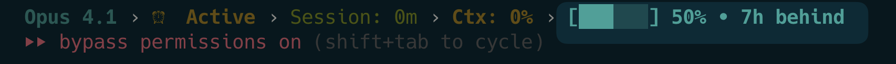

# Statusline Integration for Claude Self-Reflect

## Overview

Claude Self-Reflect integrates with the Claude Code statusline to display real-time indexing status. This provides visual feedback about your conversation memory indexing progress directly in your terminal.

## Visual Examples

### Full Indexing (100%)

*Shows: Progress bar at 100% with no indexing lag*

### Partial Indexing (50%)

*Shows: Progress bar at 50% with "7h behind" indicating indexing backlog*

## What You'll See

When properly configured, your statusline will display:
- **Progress Bar**: `[███████ ]` - Visual representation of indexing percentage
- **Percentage**: `91%` - Exact indexing percentage for your project
- **Indexing Lag**: `• 5m behind` or `• 7h behind` - How far behind the indexer is
- **Color Coding**:
  - 🔴 Red: < 25% indexed
  - 🟡 Yellow: 25-50% indexed  
  - 🔵 Cyan: 50-75% indexed
  - 🟢 Green: ≥ 75% indexed

## How It Works

### 1. Automatic Status Updates
The system provides status through the `claude-self-reflect status` command:
```bash
# Get current status
claude-self-reflect status

# Output (JSON):
{
  "overall": {
    "percentage": 98.3,
    "indexed": 451,
    "total": 459
  },
  "current_project": {
    "name": "claude-self-reflect",
    "percentage": 99.5,
    "indexed": 197,
    "total": 198
  }
}
```

### 2. Environment Variable Export
The session startup hook exports indexing status to `CSR_INDEXING_STATUS`:
```bash
export CSR_INDEXING_STATUS="96.9"
```

### 3. Statusline Integration
If you have a statusline wrapper like `cc-statusline`, it will automatically:
- Read the `CSR_INDEXING_STATUS` environment variable
- Call `claude-self-reflect status` for real-time updates
- Display a progress bar visualization (e.g., `[███████ ]`)
- Show exact percentage (e.g., `91%`)
- Display indexing lag when behind (e.g., `• 5m behind`)
- Update every 60 seconds (cached for performance)

## Setup Instructions

### Option 1: Using Session Startup Hook (Recommended)

1. **Configure the session startup hook** (see [session-startup-hook.md](./session-startup-hook.md)):
   ```bash
   # In your Claude Code settings, add:
   "session-startup-hook": "~/projects/claude-self-reflect/hooks/session-start-index.sh"
   ```

2. **The hook automatically**:
   - Indexes new conversations on session start
   - Exports `CSR_INDEXING_STATUS` with current percentage
   - Updates statusline if configured

### Option 2: Manual Integration

Add to your shell configuration (`.bashrc`, `.zshrc`, etc.):
```bash
# Get CSR indexing status
get_csr_status() {
  local status=$(claude-self-reflect status 2>/dev/null)
  if [ $? -eq 0 ]; then
    echo "$status" | jq -r '.current_project.percentage // .overall.percentage'
  else
    echo "0"
  fi
}

# Export for statusline
export CSR_INDEXING_STATUS=$(get_csr_status)
```

### Option 3: Custom Statusline Integration

For custom statusline implementations:
```python
#!/usr/bin/env python3
import subprocess
import json

def get_csr_status():
    """Get Claude Self-Reflect indexing status."""
    try:
        result = subprocess.run(
            ['claude-self-reflect', 'status'],
            capture_output=True,
            text=True,
            timeout=2
        )
        if result.returncode == 0:
            data = json.loads(result.stdout)
            # Prefer current project, fallback to overall
            if 'current_project' in data:
                return data['current_project']['percentage']
            return data['overall']['percentage']
    except:
        pass
    return 0

def format_status(percentage, behind_time=None):
    """Format status with progress bar and lag indicator."""
    # Create progress bar
    filled = int(percentage / 10)  # 10 segments for 100%
    bar = "█" * filled + " " * (10 - filled)
    
    # Determine color based on percentage
    if percentage < 25:
        color = "red"
    elif percentage < 50:
        color = "yellow"
    elif percentage < 75:
        color = "cyan"
    else:
        color = "green"
    
    # Format output with optional lag indicator
    status = f"[{bar}] {percentage:.0f}%"
    if behind_time:
        status += f" • {behind_time} behind"
    
    return status
```

## Performance Considerations

- **Caching**: Status is cached for 60 seconds to avoid excessive queries
- **Timeout**: Commands timeout after 2 seconds to prevent blocking
- **Fallback**: Returns "0%" or "ready" if service is unavailable
- **Efficiency**: Uses local Python status check, not Docker exec

## Troubleshooting

### Status Not Showing or Shows Wrong Format
1. Verify Claude Self-Reflect is installed:
   ```bash
   claude-self-reflect status
   ```

2. Check the watcher status for indexing lag:
   ```bash
   claude-self-reflect status | jq '.watcher'
   ```

2. Check environment variable:
   ```bash
   echo $CSR_INDEXING_STATUS
   ```

3. Ensure MCP server is running:
   ```bash
   docker ps | grep qdrant
   ```

### Incorrect Percentage
1. Force refresh:
   ```bash
   claude-self-reflect status --refresh
   ```

2. Check project detection:
   ```bash
   claude-self-reflect status | jq '.current_project.name'
   ```

### Performance Issues
- Increase cache duration in your statusline config
- Use environment variable instead of live queries
- Check Docker/Qdrant performance

## API Reference

### CLI Commands
```bash
# Get status (JSON output)
claude-self-reflect status

# Get specific project status
claude-self-reflect status --project "my-project"

# Force refresh (bypass cache)
claude-self-reflect status --refresh
```

### Environment Variables
- `CSR_INDEXING_STATUS` - Current indexing percentage (e.g., "96.9")
- `CSR_PROJECT_NAME` - Current project name (optional)
- `CSR_STATUS_CACHE_TTL` - Cache duration in seconds (default: 60)

## Integration Examples

### With cc-statusline
The statusline automatically detects and displays CSR status when available, showing:
- Progress bar visualization: `[███████ ]`
- Exact percentage: `91%`
- Indexing lag indicator: `• 5m behind` (when applicable)

### With Oh My Zsh
Add to your theme:
```bash
# In your .oh-my-zsh/themes/yourtheme.zsh-theme
CSR_STATUS='$(get_csr_status)'
PROMPT="... %{$fg[cyan]%}🔍 ${CSR_STATUS}% ..."
```

### With Starship
Add to `~/.config/starship.toml`:
```toml
[custom.csr]
command = "claude-self-reflect status | jq -r '.overall.percentage'"
when = "command -v claude-self-reflect"
symbol = "🔍 "
format = "[$symbol$output%]($style) "
style = "cyan"
```

## Related Documentation
- [Session Startup Hook](./session-startup-hook.md) - Auto-indexing on session start
- [API Reference](./api-reference.md) - Complete CLI documentation
- [Setup Guide](../README.md#setup) - Initial installation

## Understanding the Display

### Progress Bar Segments
- Each `█` represents 10% of indexing completion
- Empty spaces show remaining work
- Full bar `[██████████]` = 100% indexed

### Indexing Lag Indicator
The "behind" indicator shows how long ago the last unindexed conversation was created:
- `• 5m behind` - 5 minutes of conversations to index
- `• 7h behind` - 7 hours of backlog
- No indicator - Fully up to date

This helps you understand if the indexer is keeping up with your conversation rate.

---
*Note: Statusline integration requires Claude Self-Reflect v2.5.11 or higher*